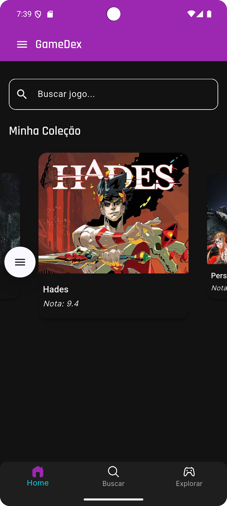
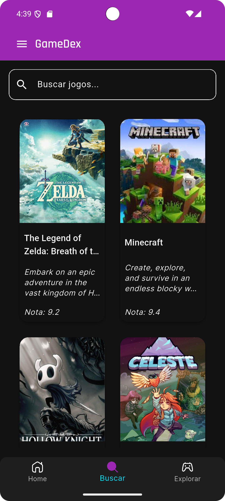
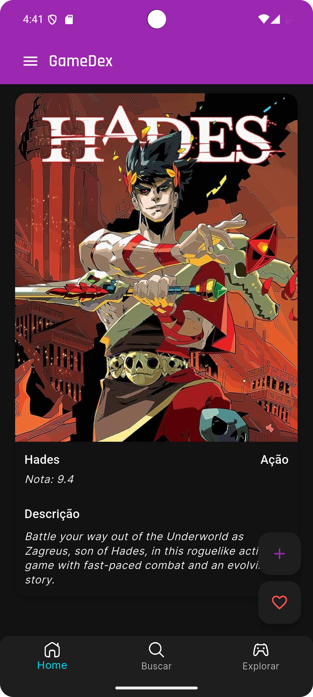
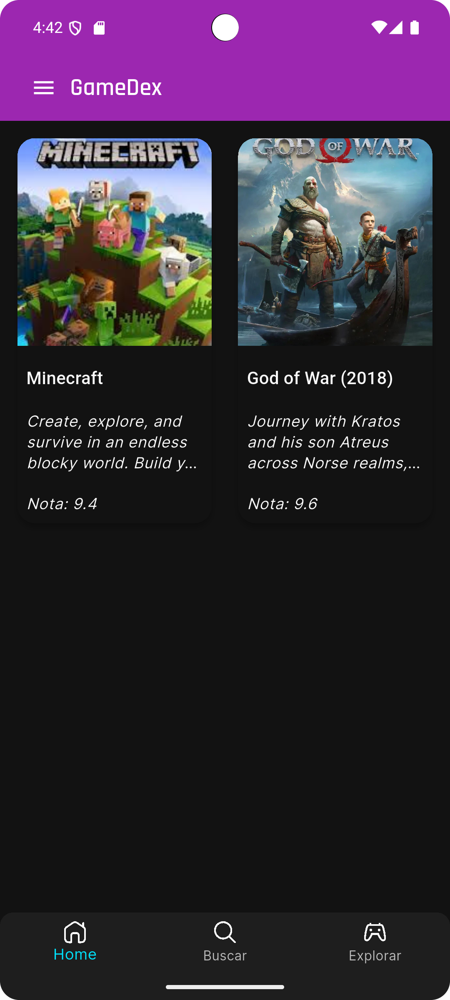
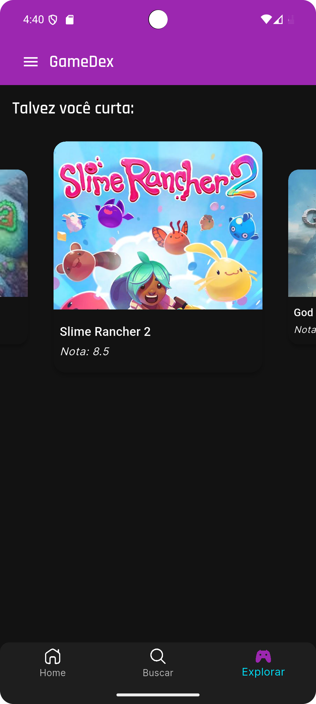

# Gamedex 🎮

[](https://flutter.dev/)
[](https://firebase.google.com/)
[](LICENSE)

**Gamedex** is a modern Flutter app that lets gamers discover, review, and track their favorite games. Explore trending games, read honest player reviews, and build your personal game collection—all in one app.

---

## 🚀 Features

- **Modern UI**: Sleek, intuitive, and gamer-friendly design.  
- **Dark & Light Mode**: Switch themes for day or night gameplay comfort.  
- **Game Reviews**: Read and write reviews to share your opinion or find top-rated games.  
- **Favorites & Collections**: Save your favorite games and maintain a personal library.  
- **Authentication**: Secure login/signup with Firebase.  
- **Real-time Database**: Firestore integration for instant updates.  
- **Recommended Games**: Recommends games based on favorite genre (most common in favorites/collection).

---

## 🛠 Tech Stack

- **Framework**: Flutter  
- **Backend & Database**: Firebase (Firestore, Authentication, Storage)  
- **UI/UX**: Responsive, modern design with dark/light mode  

---

## 📱 Screenshots







---

## 💻 Installation

1. Clone the repository:  
```bash
   git clone https://github.com/yourusername/gamedex.git
```

2. Navigate to the project directory:
```bash
   cd gamedex
```

3. Install dependencies:
```bash
    flutter pub get
```

4. Run the app on an emulator or connected device:
```bash
    flutter run
```

## 🤝 Contributing

Contributions, issues, and feature requests are welcome! Here’s how you can help:

1. Fork the repository  
2. Create a new branch for your feature or bugfix (`git checkout -b feature-name`)  
3. Make your changes and commit (`git commit -m "Add feature"`)  
4. Push to the branch (`git push origin feature-name`)  
5. Open a Pull Request and describe your changes  

Please make sure your code follows the existing style and includes relevant tests if applicable.

---

## 📄 License

This project is licensed under the [MIT License](LICENSE).  

## 🙏 Acknowledgements

- [Flutter](https://flutter.dev/) – for the amazing framework  
- [Firebase](https://firebase.google.com/) – for backend services and authentication  
- Game developers – for creating the content that makes this app possible  